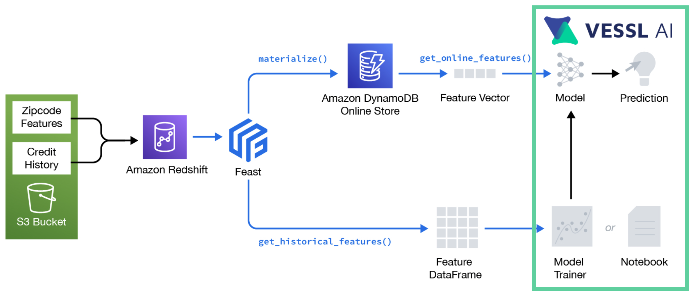

#Real-time Credit Scoring with Feast on AWS

## Summary
- This example is modified from [feast-dev/feast-aws-credit-scoring-tutorial](https://github.com/feast-dev/feast-aws-credit-scoring-tutorial) for a better understanding of how to use Feast with [VESSL](http://vessl.ai/).



## Requirements
- Terraform (v1.0 or later)
- AWS CLI (v2.2 or later)
  - Your aws credentials should be set in `~/.aws/credentials`.
- Parquet files in S3 ([s3://vessl-public-apne2/credit_scoring/](s3://vessl-public-apne2/credit_scoring/))
  ```
    credit_scoring/
      ├── credit_history/
      │     └── table.parquet
      ├── loan_features/
      │     └── table.parquet
      └── zipcode_features/
            └── table.parquet
    ```
  - You can find the source data [here](https://github.com/feast-dev/feast-aws-credit-scoring-tutorial/tree/main/data).


## Setup
### Setting up AWS infra (Redshift and S3) with Terraform 
> Note that this step should be done before running an experiment on VESSL.
We will deploy the following resources:
- Redshift cluster
- IAM roles and policies: Redshift to access S3
- Glue catalogs: zipcode features and credit history

1. Initialize terraform
```bash
cd infra
terraform init
```
2. Set terraform variables
```bash
export TF_VAR_region="ap-northeast-2"
export TF_VAR_project_name="vessl-credit-scoring-project"
export TF_VAR_admin_password="MyAdminPassword1"
```
3. Plan and deploy infrastructure on your AWS
```bash
terraform plan
terraform apply
```
Once your infrastructure is deployed, you should see the following outputs from Terraform.
```bash
redshift_cluster_identifier = "vessl-credit-scoring-project-redshift-cluster"
redshift_spectrum_arn = "arn:aws:iam::<Account>:role/s3_spectrum_role"
credit_history_table = "credit_history"
zipcode_features_table = "zipcode_features"
```
To have these outputs in env variables, you can source the `env` script.
```bash
(cd .. && source env)
```
4. Create a mapping from the Redshift cluster to the external catalog
```bash
aws redshift-data execute-statement \
    --region "${TF_VAR_region}" \
    --cluster-identifier "${tf_redshift_cluster_identifier}" \
    --db-user admin \
    --database dev \
    --sql "create external schema spectrum from data catalog database 'dev' iam_role '${tf_redshift_spectrum_arn}' create external database if not exists;"
```
To see whether the command was successful, please run the following command.
```bash
aws redshift-data describe-statement --region ${TF_VAR_region} --id [SET YOUR STATEMENT ID HERE]
```
You might find list-statements command useful to find executed statement ids.
```bash
aws redshift-data list-statements --region ${TF_VAR_region}
```
5. You should now be able to query actual zipcode features by executing the following statement.
```bash
aws redshift-data execute-statement \
    --region "${TF_VAR_region}" \
    --cluster-identifier "${tf_redshift_cluster_identifier}" \
    --db-user admin \
    --database dev \
    --sql "SELECT * from spectrum.zipcode_features LIMIT 1;"
```
which should print out results by running
```bash
aws redshift-data describe-statement --region ${TF_VAR_region} --id [SET YOUR STATEMENT ID HERE]
```
You should have one `ResultsRows` without any error.
```bash
{
    "ClusterIdentifier": "vessl-credit-scoring-project-redshift-cluster",
    "CreatedAt": "2023-XX-XXT19:03:36.334000+09:00",
    "Duration": 1201593573,
    "HasResultSet": true,
    "Id": "37c0cf66-4321-4ab1-83b6-5a84a507556e",
    "QueryString": "SELECT * from spectrum.zipcode_features LIMIT 1;",
    "RedshiftPid": 1073758360,
    "RedshiftQueryId": 326,
    "ResultRows": 1,
    "ResultSize": 135,
    "Status": "FINISHED",
    "UpdatedAt": "2023-XX-XXT19:03:38.094000+09:00"
}
```
### Setting up Feast
Install Feast using pip
```bash
pip install feast[aws]
```
Deploy the feature store by running `apply` from within the `feature_repo/` directory.
```bash
cd feature_repo
feast apply
```
Once `feast apply` has finished, you can see the following created entities and deploying infrastructure statement.
```bash
Created entity dob_ssn
Created entity zipcode
Created feature view zipcode_features
Created feature view credit_history

Deploying infrastructure for zipcode_features
Deploying infrastructure for credit_history
```
Let's put a `feature_store.yaml` to S3.
```bash
aws s3api put-object --bucket vessl-public-apne2 --key credit_scoring/feature_repo/feature_store.yaml --body feature_store.yaml
```
Next we load features into the online store using materialize command.
```bash
CURRENT_TIME=$(date -u +"%Y-%m-%dT%H:%M:%S")
feast materialize "2013-01-01" $CURRENT_TIME
```
```bash
Materializing 2 feature views from 2013-01-01 09:00:00+09:00 to 2023-01-30 09:32:29+09:00 into the dynamodb online store.

zipcode_features:
01/30/2023 09:34:12 AM botocore.credentials INFO: Found credentials in shared credentials file: ~/.aws/credentials
100%|███████████████████████████████████████████████████████| 28844/28844 [00:25<00:00, 1134.96it/s]
credit_history:
100%|███████████████████████████████████████████████████████| 28633/28633 [00:27<00:00, 1043.41it/s]
```

## Train and test the model
Finally, we train the model on VESSL using a combination of loan data from S3 and our zipcode and credit history features from
Redshift (which in turn queries S3), and then we test online inference by reading those same features from DynamoDB.
### Start command
```bash
pip install -r examples/credit_scoring/requirements.txt && python examples/credit_scoring/main.py
```
The script should then output the result of a single loan application
```bash
loan rejected!
```

## Interactive demo (using Streamlit)
Once the credit scoring model has been trained it can be used for interactive loa application using Streamlit.
Simply start the Streamlit application.
```bash
streamlit run app.py
```
Then navigate to the URL on which Streamlit is being served. You should see a user interface through which 
loan applications can be made:


## Destroy the deployed infrastructure
```bash
cd infra
terraform destroy 
```
