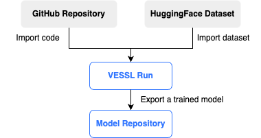
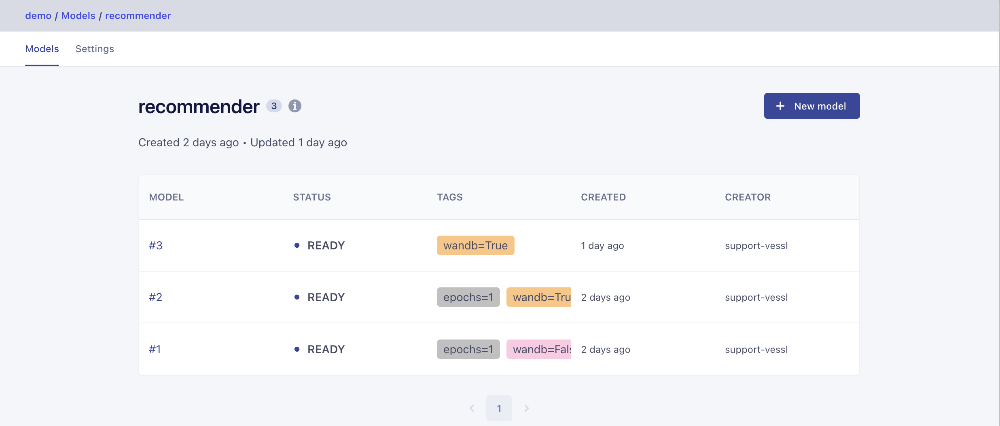
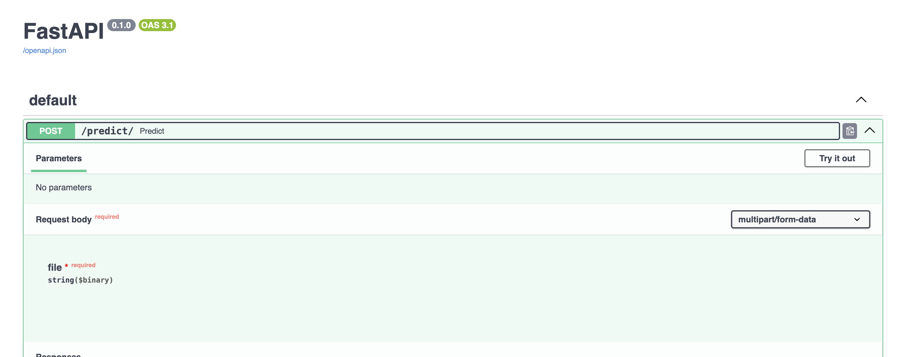

VESSL Guide for SasRec Model Serving
------

[](README.md) [](README-ko.md)


## Table of Contents
0. [Before You Start](#before-you-start)
1. [Training Recommender System with VESSL Run](#training-recommender-system-with-vessl-run)
2. [Building an Online Recommender System with VESSL Serve](#building-an-online-recommender-system-with-vessl-serve)
---

## Before You Start

### Installing and Checking VESSL CLI Login
Before starting, use the following commands to ensure the [VESSL CLI](https://pypi.org/project/vessl/) is installed, and you are correctly logged in.

```sh
# Install VESSL CLI
$ pip install vessl
   
# Check login status
$ vessl whoami

# If not logged in, proceed with login using the vessl configure command
$ vessl configure
```

### First Time Using VESSL?

If you're new to VESSL, it's recommended to familiarize yourself with the basic usage through the [Quickstart](https://docs.vessl.ai/docs/en/get-started/quickstart) guide.

---

## Training Recommender System with VESSL Run

### Overview

This example introduces the process of training the [SasRec model](https://arxiv.org/abs/1808.09781) from the [Recommenders](https://github.com/recommenders-team/recommenders) package using [VESSL Run](https://docs.vessl.ai/), and storing the results in a model repository. The training code is located at [sasrec/main.py](sasrec/main.py), and the dataset used is the [AWS Beauty Dataset](https://huggingface.co/datasets/VESSL/amazon-beauty-dataset) published on HuggingFace.



### Preparation

Before starting the training, use the VESSL CLI to create a model repository to store the trained model.

```sh
# Create a new model repository named 'recommender'
$ vessl model-repository create recommender

# Check if the model repository was created
$ vessl model-repository list 
```

### Training

In VESSL, a Run is the basic unit for executing tasks, including all necessary information such as code, commands, AI models, packages, environment variables, etc. The definition of a Run is written in a YAML file, as shown below in the example used.

> **Note**: In the YAML file below, replace `{organizationName}` and `{modelRepositoryName}` with the appropriate values.

```yaml
# sasrec-train.yaml
name: sasrec-train
description: Training a recommender system on amazon beauty dataset.
resources:  
  cluster: vessl-aws-seoul
  preset: cpu-large
image: quay.io/vessl-ai/python:3.9-r2  
import:  
  /input/: hf://huggingface.co/datasets/VESSL/amazon-beauty-dataset
  /root/examples/: git://github.com/vessl-ai/examples
export:  
  /output/: vessl-model://{organizationName}/{modelRepositoryName}
run:
  - workdir: /root/examples/recommenders/sasrec
    command: pip install -r requirements.txt
  - workdir: /root/examples/recommenders/sasrec
    command: python main.py
  - workdir: /root
    command: pip install --upgrade vessl
```

Use the [sasrec-train.yaml](sasrec-train.yaml) file included in the example folder to create a Run.

```sh
vessl run create -f sasrec-train.yaml
```
Executing the above command will create a Run as shown below.


The [sasrec-train.yaml](sasrec-train.yaml) file defines essential components for model training:
* **Resource and Container Image Settings**: Specifies the resources and container image to use.
* **GitHub Repository Information for Code Import**: Downloads code to `/root/examples`.
* **HuggingFace Dataset Information for Data Import**: Downloads dataset to `/input`.
* **Repository Information for Storing the Trained Model**: Uploads stored data in `/output` to the model repository after training is completed.

### Checking Training Results via the Web Dashboard

Once a Run is successfully created, a web dashboard link to monitor the status of the Run in real-time is provided through the CLI. This link allows direct monitoring of the training process and results through the VESSL web interface.


### (Optional) Using Wandb Logging

To track various metrics during model training, you can use the logging feature of [wandb]((https://wandb.ai/)). The part of the [sasrec-train-wandb.yaml](sasrec-train-wandb.yaml) file below demonstrates how to activate logging to Weights & Biases.
Sensitive information like `WANDB_KEY` should be specified as an environment variable (`env`) with `secret: true`. For more details, refer to [VESSL Docs > YAML Reference](https://docs.vessl.ai/yaml-reference/en/yaml#environment-variables).

> **Note**: Replace `{YOUR_WANDB_KEY}` in the YAML file below with the value from https://wandb.ai/authorize.

```yaml
name: SasRec-train-wandb
...
run:
  - ... 
  - workdir: /root/examples/recommenders/sasrec
    command: python main.py --wandb-log True
  - ...
env:
  WANDB_KEY:
    value: {YOUR_WANDB_KEY}
    secret: true
```
### Tracking Training Process with Wandb

You can monitor the training process in real-time on the wandb dashboard by finding the wandb link in the VESSL Run log. This allows effective analysis and improvement of the model's performance metrics and training process.


---

## Building an Online Recommender System with VESSL Serve

### Overview

This example introduces the process of serving the trained recommender model online using [VESSL Serve](https://docs.vessl.ai/user-guide/serve). The trained model is deployed in a real-time service environment to provide immediate recommendation results in response to user requests, guided step-by-step.


### Finding the Trained Model

After the Run completes and the model training successfully finishes, the trained model is automatically uploaded to the model repository path specified in the `export` item. You can check Run-related information on the web dashboard, and in the Files tab, the file structure of the Run can be seen in a tree format. The `export` path can also be accessed through a link.


Files in the Files tab can be downloaded locally, and through the link, you can access the model repository to see the stored models.



You can also use the CLI to check the list of models stored in the model repository or to query file information of a specific model (e.g., model number 3).

```sh
# List models stored in the 'recommender' model repository
$ vessl model list recommender

# Query file information of a specific model (e.g., model number 3) in the 'recommender' model repository
$ vessl model list-files recommender 3
```

### Creating a New Serving from the Web Dashboard

Select the Servings tab in VESSL's web dashboard and click the `+ New serving` button to create a Serving.

The created Serving can be verified using the following CLI command:

```sh
# List created servings
$ vessl serve list
```

### Creating a New Revision with YAML

VESSL Serve includes all necessary information such as code, commands, AI models, packages, environment variables, autoscaling, ports, etc. The Serve definition is provided in a YAML file. Below is an example YAML file for serving the SasRec model.

```yaml
# sasrec-serve.yaml
message: SasRec serving from YAML
image: quay.io/vessl-ai/python:3.9-r2
resources:
  cluster: vessl-aws-seoul
  name: cpu-medium
volumes:
  /model:
    model:
      repo: recommender
      version: 1
  /examples: git://github.com/vessl-ai/examples
run:
  cd /examples/recommenders/sasrec && pip install -r requirements.serve.txt && python model.py --model-path $model_path
env:
  - key: model_path
    value: /model
autoscaling:
  min: 1
  max: 3
  metric: cpu
  target: 60
ports:
  - port: 5000
    name: service
    type: http
launch_immediately: true
```

Use the [sasrec-serve.yaml](sasrec-serve.yaml) file included in the example folder to create a new Serve Revision.

```sh
# Create a new revision for 'recommenders-serving' serving
$ vessl serve revision create --serving recommenders-serving -f sasrec-serve.yaml
```

### Updating the Gateway for the Created Revision

After creating the Revision, update the Gateway to activate the endpoint.

```yaml
# sasrec-serve-gateway.yaml
enabled: true
targets:
  - number: 1
    port: 5000
    weight: 100
```

Use the [sasrec-serve-gateway.yaml](sasrec-serve-gateway.yaml) file to update the Gateway.

```sh
# Update the gateway for 'recommenders-serving' serving
$ vessl serve gateway update --serving recommenders-serving -f sasrec-serve-gateway.yaml

# Show the updated gateway for 'recommenders-serving' serving
$ vessl serve gateway show --serving recommenders-serving
```

To check if the API server is functioning properly, navigate to `http://{API_ENDPOINT_URL}/docs`.



Test the API server's response with a simple HTTP POST request. The used [test_amazon_beauty.csv](test_amazon_beauty.csv) is a simple list of purchased product numbers.

```csv
# test_amazon_beauty.csv
1, 12, 123, 13, 5
```

```sh
$ curl -X 'POST' \
  'https://model-service-gateway-72fxbpvoqb3y.seoul.aws-cluster.vessl.ai/predict/' \
  -H 'accept: application/json' \
  -H 'Content-Type: multipart/form-data' \
  -F 'file=@test_amazon_beauty.csv;type=text/csv'
  
"item 2000"
```
