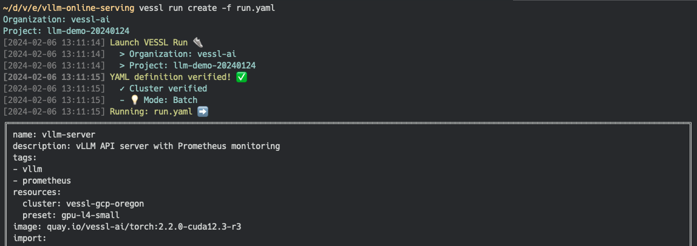
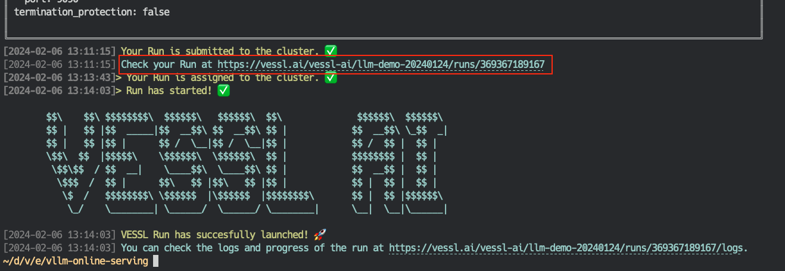
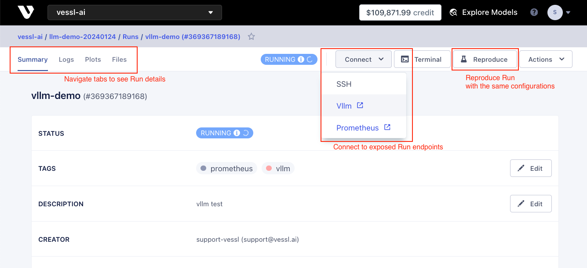

# Online Serving with vLLM and VESSL Run (한글 문서)
------

[](README.md) [](README-ko.md)

이 문서는 VESSL Run과 vLLM을 이용하여 LLM을 더 빠르게 추론할 수 있는 모델 API를 만드는 방법을 설명합니다.
* [VESSL Run](https://run-docs.vessl.ai/) 은 AI 모델을 빠르게 빌드하고 배포할 수 있는 플랫폼입니다.
* [vLLM](https://vllm.ai/) 은 [PagedAttention](https://arxiv.org/pdf/2309.06180.pdf) 등의 기술을 기반으로 LLM 추론의 성능을 크게 높일 수 있는 라이브러리입니다.

> **Note**:
> * 시작하기 전 CLI 환경에서 아래 커맨드를 실행하여 VESSL에 잘 로그인되었는지 확인해주세요:
>   ```sh
>   # Check if you are logged in
>   vessl whoami
> 
>   # If not, configure VESSL CLI with your VESSL credentials
>   vessl configure
>   ```
> * VESSL Run은 단일 컨테이너에서 노트북, 학습, 추론 서비스 등을 실행하기 위한 기능입니다. Autoscaling이나 Load Balancing 등 Production-level AI 서비스에 필요한 기능을 함께 사용하기 위해서는 [VESSL Serve](https://docs.vessl.ai/user-guide/serve)를 참고해주세요.

## Deploying vLLM server with VESSL Run

VESSL에서 Run은 태스크 실행의 기본 단위입니다. Run의 정의에는 코드, 커맨드, AI 모델, 패키지, 환경 변수 등 각종 작업을 실행하기 위한 정보가 포함됩니다. 

Run의 정의는 YAML 파일로 작성됩니다. 예를 들면, 이번 예제의 YAML 파일 중 일부를 아래와 같이 작성할 수 있습니다:

```yaml
# vllm-online-serving.yaml
name: vllm-server
description: LLM server with vLLM and Prometheus monitoring
tags:
  - vllm
  - model=mistral-7b-instruct-v0.2
resources: # Resource requirements
  cluster: vessl-gcp-oregon
  preset: gpu-l4-small
image: quay.io/vessl-ai/torch:2.2.0-cuda12.3-r3 # Container image
import: # Code, data, or model to import
  /code/:
    git:
      url: github.com/vessl-ai/examples.git
      ref: main
run:
  - command: |- # Command to run the API server
      ...
    workdir: /code
ports: # Endpoint configuration
  - name: vllm
    type: http
    port: 8000
  - name: prometheus
    type: http
    port: 9090
```

예제 폴더에 포함된 [vllm-online-serving.yaml](vllm-online-serving.yaml) 파일을 사용하여 Run을 생성해봅니다.

```sh
vessl run create -f vllm-online-serving.yaml
```

위 명령어를 실행하면 아래 스크린샷과 같이 Run이 생성됩니다.



[vllm-online-serving.yaml](vllm-online-serving.yaml) 파일에는 아래 내용들이 정의되어 있습니다:
* 사용할 리소스 및 컨테이너 이미지
* 코드를 가져오기 위한 git repository 정보
* 모니터링 도구 Prometheus를 실행하기 위한 커맨드
* vLLM 기반의 LLM API 서버를 실행하기 위한 커맨드
* API 서버와 Prometheus의 endpoint를 연결하기 위한 설정

> **Note**: Run을 생성하는 방법에 대한 자세한 내용은 [VESSL Run Quickstart](https://run-docs.vessl.ai/docs/en/get-started/quickstart)를 참고해주세요!

## Accessing VESSL Run with Web Dashboard 

Run이 생성된 후, CLI 환경에서 아래와 같이 Run의 상태를 확인할 수 있는 Web Dashboard의 링크를 확인할 수 있습니다.



대시보드에서 Run의 세부 정보, 연결된 서비스 엔드포인트 등을 확인할 수 있고, 버튼 한 번으로 Run을 쉽게 재현할 수 있습니다.



## Testing the API

Run Dashboard에서 Connect -> `vllm` 을 선택해서 API endpoint로 이동합니다. 웹 브라우저의 주소창에 있는 URL (`API_ENDPOINT_URL`)을 확인하실 수 있습니다.


`http://{API_ENDPOINT_URL}:8000/docs` 로 이동하여 API 서버가 잘 작동하는지 확인하실 수 있습니다.

간단한 HTTP POST request를 보내서 API 서버가 잘 작동하는지 확인해봅니다.

```sh
$ curl -X POST \
    http://{API_ENDPOINT_URL}/generate \
    -d '{"prompt":"What is the capital state of South Korea?"}'

{"text":["\n\nThe capital state of South Korea is Seoul.\n\n"]}
```

## Advanced: Benchmarking API server

`vLLM` 은 Prometheus 기반으로 LLM 서비스의 모니터링에 필요한 주요 지표들을 수집할 수 있는 기능을 제공합니다. vLLM 서비스가 제공하는 지표들의 예시는 다음과 같습니다.
* E2E request latency: API 서버에 요청을 보내고 응답을 받는데 걸리는 시간
* Token throughput: 초당 처리/생성하는 토큰의 수
* Time per first token: 요청을 받아 첫 번째 토큰을 생성하는데 걸리는 시간
* Cache utilization: GPU VRAM 내의 KV cache에 저장된 데이터를 사용하는 비율

> **Note**: LLM 서비스를 위한 Metric 기능은 vLLM의 최신 upstream 버전에 포함되어 있으며, 2024년 2월 현재 Stable release로 아직 배포되지 않았습니다. 사용시 주의해주세요!

로컬 환경에서 아래와 같이 vLLM을 설치하고, benchmark 스크립트를 실행하여 API 서버의 성능을 확인할 수 있습니다.

```sh
# Install vLLM and required dependencies
# You might need CUDA available on your local environment to install vLLM
pip install aiohttp vllm

# Clone the vLLM repository (which contains benchmark script)
git clone https://github.com/vllm-project/vllm

# Get sample prompt for benchmarking
wget https://huggingface.co/datasets/anon8231489123/ShareGPT_Vicuna_unfiltered/resolve/main/ShareGPT_V3_unfiltered_cleaned_split.json

# Run the benchmark script
python vllm/benchmarks/benchmark_serving.py \
  --backend vllm \
  --protocol http \
  --host {API_SERVER_ENDPOINT} \
  --port 8000 \
  --tokenizer mistralai/Mistral-7B-Instruct-v0.2 \
  --request-rate 3 --dataset ShareGPT_V3_unfiltered_cleaned_split.json 
```

위에서 실행한 Run에는 Prometheus가 이미 실행되고 있습니다. Run Dashboard에서 Connect -> `prometheus` 을 선택해서 접속하여 Prometheus UI와 API 서버의 각종 지표를 확인하실 수 있습니다.


Prometheus source를 Grafana에 연결하여 아래와 같이 더 직관적으로 시각화된 대시보드를 구축할 수도 있습니다.\
더 자세한 내용은 [vLLM의 공식 문서](https://github.com/vllm-project/vllm/tree/main/examples/production_monitoring)를 참고해주세요!


## Cleaning up

`vessl run terminate` 커맨드를 사용하여 실행중인 Run을 종료할 수 있습니다.

```sh
# List runs to find the ID of the run to terminate
$ vessl run list

Organization: vessl-ai
Project: llm-demo-20240124
 ID            Name           Type         Status      Created                    Description
 ............  pdf-chatbot    batch        terminated  2024-01-25 01:37:52+00:00
 ............  pdf-chatbot    interactive  terminated  2024-01-25 01:47:11+00:00
 ............  vllm-demo      batch        terminated  2024-02-05 14:37:27+00:00
 ............  test-notebook  interactive  terminated  2024-02-05 14:47:10+00:00
 369367189168  vllm-demo      batch        running     2024-02-06 04:16:36+00:00

# Terminate the run
$ vessl run terminate 369367189168

Organization: vessl-ai
Project: llm-demo-20240124
Terminated '#369367189168'.
```

Web dashboard에서 오른쪽 상단 Actions -> Terminate을 클릭하여도 Run을 종료할 수 있습니다.


## Advanced Topics for Faster Deployment

예제에서는 파일 하나로 쉽게 VESSL Run을 생성하고 endpoint를 확인하는 방법을 설명했습니다. 제공된 예제보다 Run을 더 빠르게 실행하고 싶을 때 적용할 수 있는 몇 가지 방법들을 소개합니다.

### Build a custom Docker image for faster Run turn-up

Run을 실행하는 과정에서 Prometheus와 vLLM 설치 등 초기화 작업을 수행하는 것을 로그에서 확인하실 수 있습니다. 이러한 초기화 작업을 Docker 이미지에 포함시켜서 Run을 더 빠르게 실행할 수 있습니다.

아래는 각종 dependency를 포함한 Docker 이미지를 빌드하는 예시입니다.

```Dockerfile
FROM quay.io/vessl-ai/torch:2.2.0-cuda12.3-r3

ENV PROMETHEUS_VERSION=2.49.1

WORKDIR /app

# Download and unzip prometheus binary to /app/prometheus
RUN wget https://github.com/prometheus/prometheus/releases/download/v$PROMETHEUS_VERSION/prometheus-$PROMETHEUS_VERSION.linux-amd64.tar.gz
RUN tar -xvf prometheus-$PROMETHEUS_VERSION.linux-amd64.tar.gz
RUN mv prometheus-$PROMETHEUS_VERSION.linux-amd64 ./prometheus
RUN rm prometheus-$PROMETHEUS_VERSION.linux-amd64.tar.gz

# Copy prometheus.yml
COPY monitoring/prometheus.yml /app/prometheus/prometheus.yml

# Install dependencies
COPY requirements.txt /app/requirements.txt
RUN pip install -r /app/requirements.txt

# Entrypoint
ENTRYPOINT ["python", "-m", "api.py"]
```

### Caching `~/.cache/huggingface` for faster model loading

예제에서는 HuggingFace의 모델을 사용하고 있습니다. HuggingFace의 모델은 처음 로딩할 때 다운로드를 받아야 하기 때문에, 처음 로딩하는데 시간이 소요됩니다. 이러한 시간을 줄이기 위해서 `~/.cache/huggingface` 디렉토리를 미리 캐싱해둘 수 있습니다.

VESSL Artifacts를 사용하여 아래와 같이 `~/.cache/huggingface` 디렉토리를 캐싱할 수 있습니다. Run이 종료될 때 해당 디렉토리를 Artifacts로 저장하고, 다음 Run에서는 Artifacts를 다시 불러와서 사용할 수 있습니다.


YAML manifest에서는 `import` 와 `export` 영역이 아래와 같이 추가됩니다.

```yaml
import:
  ...
  /root/.cache/huggingface/: vessl-artifact://{ORGANIZATION}/{PROJECT}/huggingface-models
export:
  /root/.cache/huggingface/: vessl-artifact://{ORGANIZATION}/{PROJECT}/huggingface-models

```

같은 방법으로 HuggingFace뿐만 아니라 필요한 라이브러리, 모델 등을 VESSL Artifact에 캐싱하여 사용할 수 있습니다.
